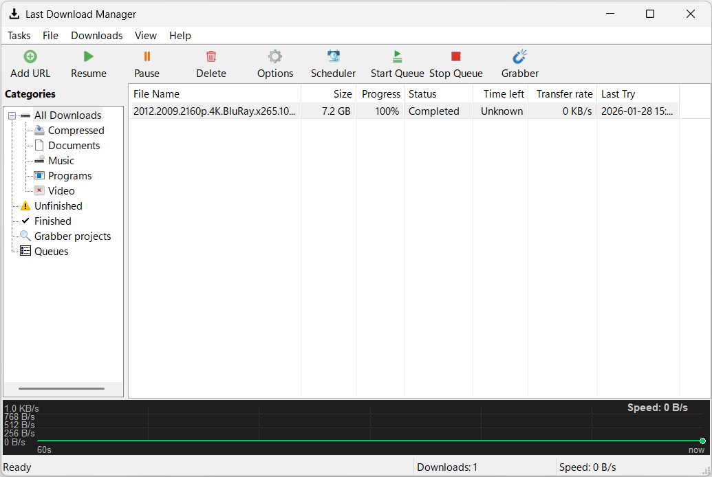

# LastDM - Modern Download Manager

A modern, feature-rich download manager built with C++ and wxWidgets.


## Screenshot



## Features

- 🚀 **Multi-threaded Downloads** - Fast parallel downloading with multiple connections
- 📊 **Real-time Speed Graph** - Visual download speed monitoring
- 📁 **Category Management** - Organize downloads by type (Documents, Videos, Music, etc.)
- ⏰ **Scheduler** - Schedule downloads for specific times
- ✅ **Checksum Verification** - MD5/SHA256 hash verification
- 🎨 **Modern UI** - Clean and intuitive interface
- 🔔 **System Tray** - Minimize to system tray with notifications
- 💾 **Persistent Downloads** - Resume interrupted downloads

## Requirements

- **Windows 10/11**
- **Visual Studio 2019/2022** with C++ desktop development workload
- **CMake 3.16+**
- **vcpkg** package manager

## Dependencies

Install via vcpkg:

```bash
vcpkg install wxwidgets:x64-windows
vcpkg install curl:x64-windows
vcpkg install sqlite3:x64-windows
```

## Building

### Using CMake

```bash
# Create build directory
mkdir build
cd build

# Configure (adjust vcpkg path if needed)
cmake .. -DCMAKE_TOOLCHAIN_FILE=C:/vcpkg/scripts/buildsystems/vcpkg.cmake

# Build
cmake --build . --config Release
```

### Using Visual Studio

1. Open the project folder in Visual Studio
2. Visual Studio will automatically detect CMakeLists.txt
3. Select Release x64 configuration
4. Build → Build All

## Project Structure

```
LastDM/
├── CMakeLists.txt          # Build configuration
├── src/
│   ├── main.cpp            # Application entry point
│   ├── core/               # Download engine and management
│   ├── ui/                 # User interface components
│   ├── database/           # SQLite database management
│   └── utils/              # Utilities (settings, themes, hash)
└── resources/              # Icons and assets
```

## License

This project is open source. Feel free to use and modify.

## Contributing

Contributions are welcome! Please feel free to submit a Pull Request.
